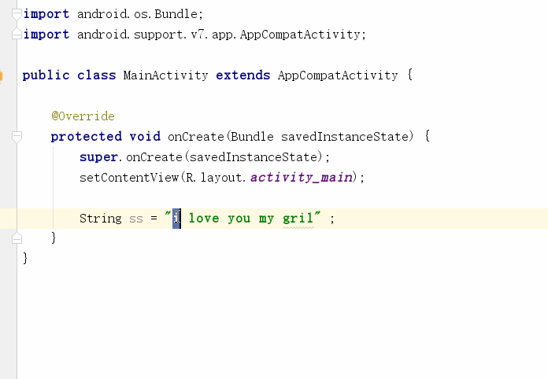
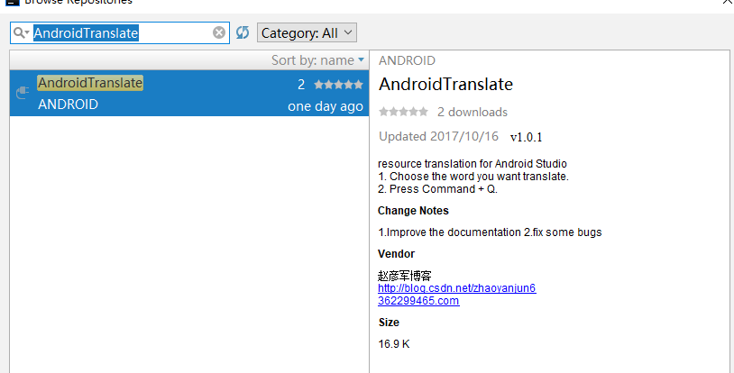

# PluginTranslate 介绍
这是一个Android 单词翻译插件

效果图：

# 如何使用

在Android Studio 插件市场搜索 `AndroidTranslate`

安装完成后，重启 Android Studio 就可以了。

插件市场 https://plugins.jetbrains.com/

## 博客

[Android Studio 插件开发详解一：入门练手](http://blog.csdn.net/zhaoyanjun6/article/details/78112003)

[Android Studio 插件开发详解二：工具类](http://blog.csdn.net/zhaoyanjun6/article/details/78112856)

[Android Studio 插件开发详解三：翻译插件实战](http://blog.csdn.net/zhaoyanjun6/article/details/78113868)

[Android Studio 插件开发详解四：填坑](http://blog.csdn.net/zhaoyanjun6/article/details/78265540)